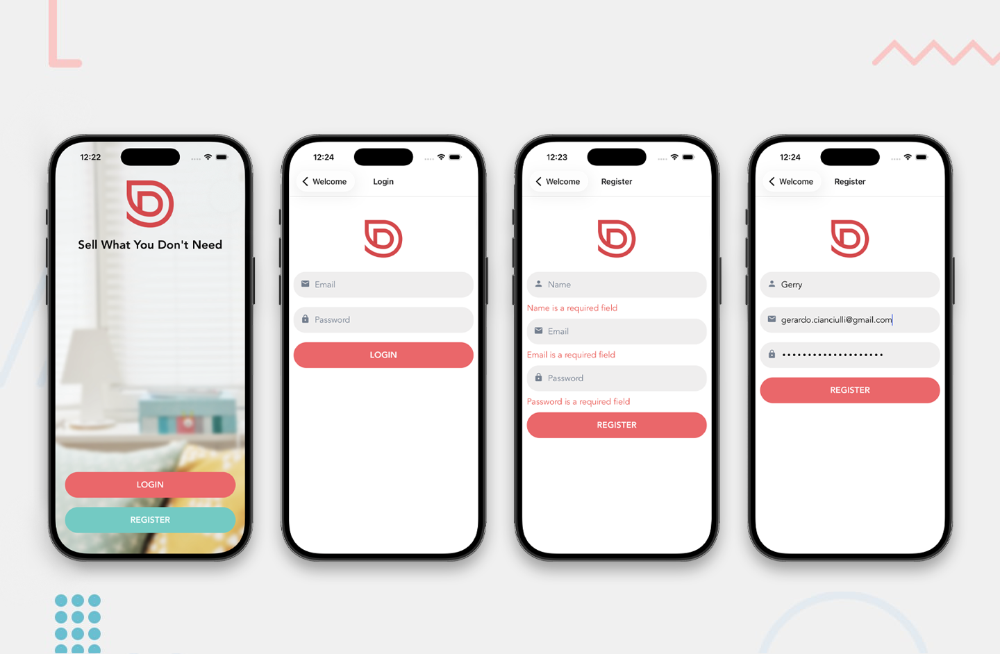
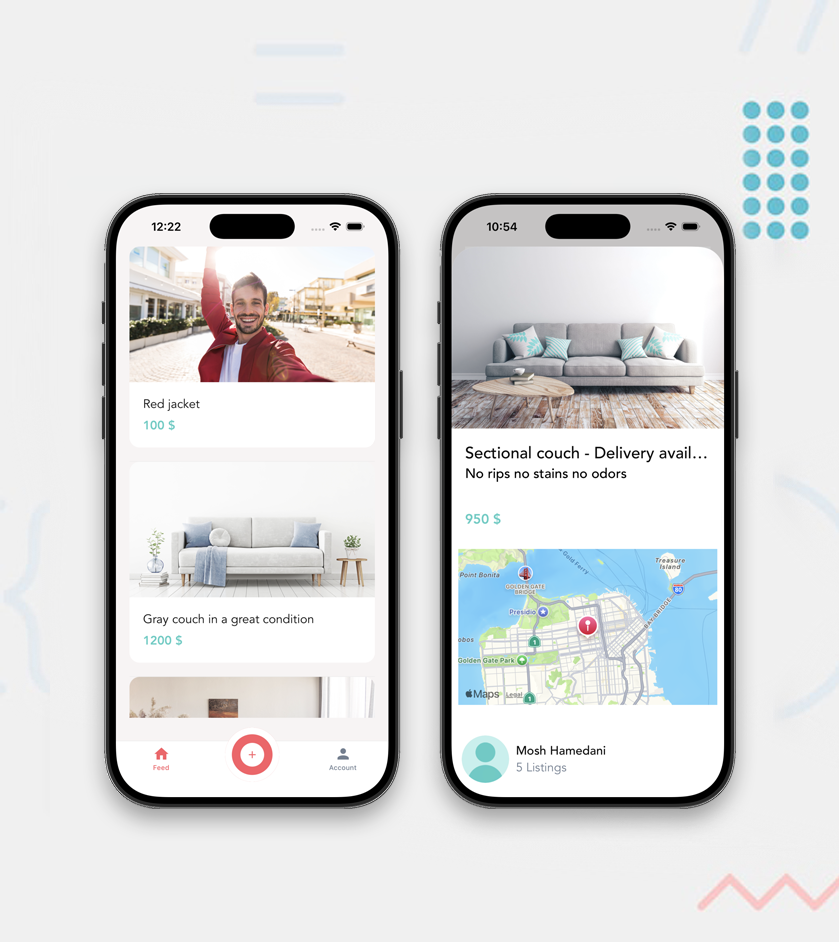
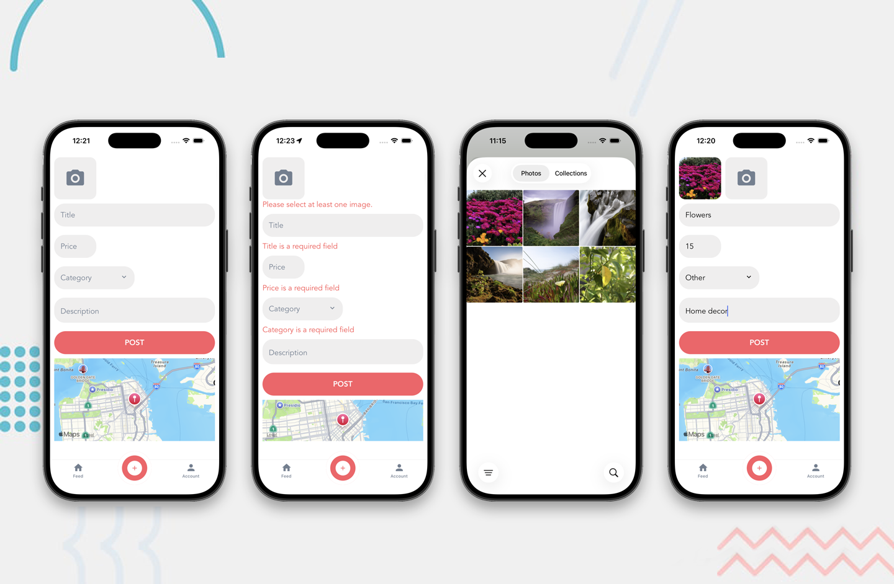
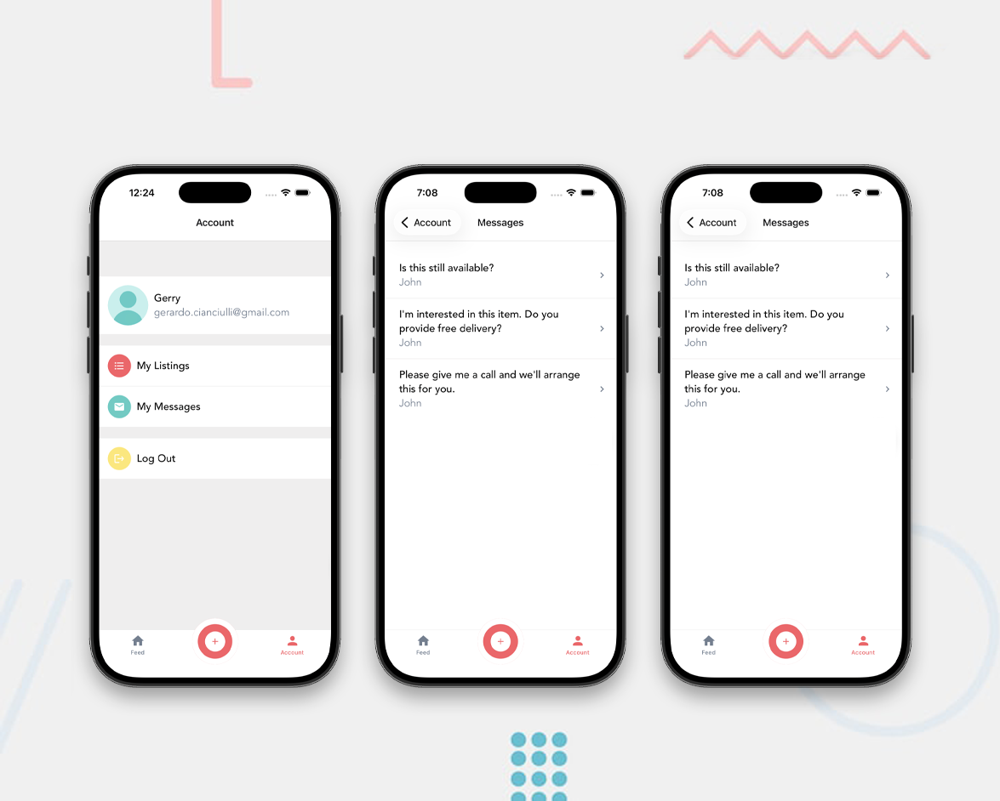

# Done With It - Mobile app









## Table of contents

- [Overview](#overview)
  - [The challenge](#the-challenge)
  - [Build](#build)
- [My process](#my-process)
  - [Built with](#built-with)
  - [What I learned](#what-i-learned)
- [Author](#author)

## Overview

### The challenge

### Build

- Copy the directory from Github

```bash
git clone https://github.com/GerardoCianciulli/done-with-it.git
```

- Run the mobile app on an iPhone simulator or Android emulator

```bash
cd done-with-it
npx expo start
```

- In a seperate terminal run the backend

```bash
cd done-with-it/backend
node index
```

## My process

### Built with

- React Native
- Expo
- TypeScript
- Semantic HTML5 markup
- Flexbox

### What I learned

## Author

- Portfolio - [Gerardo Cianciulli](https://www.behance.net/gerardo-cianciulli)
- Frontend Mentor - [Gerardo Cianciulli](https://www.frontendmentor.io/profile/GerardoCianciulli)
- Linkedin - [Gerardo Cianciulli](https://www.linkedin.com/in/gerardo-cianciulli/)
